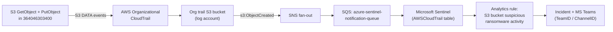

<!-- markdownlint-disable MD013 MD033 -->
# Runbook: Test the Sentinel analytics rule "S3 bucket suspicious ransomware activity"

| | |
| --- | --- |
| **Rule under test** | `S3 bucket suspicious ransomware activity` (AWS‑Test variant: `S3 bucket suspicious ransomware activity AWS-Test`) |
| **Test AWS account** | `sp.sauron.test` — `364046303400` (tenant **AWS‑Test**) |
| **Region** | `eu-west-1` |
| **Working branch** | `to-test-rule-S3-bucket-suspicious-ransomware-activity` |
| **Source policy** | [AWS_S3Ransomware.yaml](https://github.com/Azure/Azure-Sentinel/blob/master/Solutions/Amazon%20Web%20Services/Analytic%20Rules/AWS_S3Ransomware.yaml) |
| **Rule docs (IaC source of truth)** | [bootstrap/shared-services/logging/docs/README.md.tftpl](../../bootstrap/shared-services/logging/docs/README.md.tftpl) → section `#### S3 bucket suspicious ransomware activity` |
| **Reference PR pattern** | [#2811 – Add Sentinel rules for detecting suspicious S3, RDS, and EC2 activities](https://github.com/volvo-cars/mb-aws-infrastructure_as_code/pull/2811) |

> ⚠️ **Read this first.** This runbook is *test/validation only*. Every resource it creates is throwaway and must be removed afterwards (see [Part F – Cleanup](#part-f--cleanup-iac)). Do **not** run this in any production account. Only `364046303400` (`sp.sauron.test`) is approved, per the manager.

---

## 1. What you are actually testing (and what you are not changing)



* The **analytics rule itself lives in Microsoft Sentinel (Azure)** and is managed there — **not** in this repo. This repo only:
  * wires CloudTrail → S3 → SNS → SQS → Sentinel (in [bootstrap/shared-services/logging](../../bootstrap/shared-services/logging)); and
  * **documents** every rule's KQL in [bootstrap/shared-services/logging/docs/README.md.tftpl](../../bootstrap/shared-services/logging/docs/README.md.tftpl), which is rendered to `README.md` / `README_TEST.md`.
* So "testing the rule" = **generate the CloudTrail events that the rule's KQL looks for**, confirm they reach Sentinel, and confirm the rule fires.
* The test infrastructure (S3 bucket, KMS key, seed object) **must be created as IaC** (Part A). The two attack actions (`GetObject`, `PutObject`) are **runtime AWS API calls** — they cannot be Terraform resources, so they are done with the AWS CLI (Part C).

### 1.1 The detection logic you must satisfy

This is the KQL deployed for the rule (matches the logic shared by the client):

```kql
let timeframe = 1h;
let lookback = 2h;
// The attacker downloads the object(s) from the compromised bucket
let GetObject = AWSCloudTrail
    | where TimeGenerated >= ago(lookback)
    | where EventName == "GetObject" and isempty(ErrorCode) and isempty(ErrorMessage)
    | extend bucketName = tostring(parse_json(RequestParameters).bucketName),
             keyName    = tostring(parse_json(RequestParameters).key)
    | project-rename StartTime = TimeGenerated;
// Then, the attacker overwrites the same object(s) but encrypted with his own key
let PutObject = AWSCloudTrail
    | where TimeGenerated >= ago(timeframe)
    | where EventName == "PutObject" and isempty(ErrorCode) and isempty(ErrorMessage)
    | extend bucketName = tostring(parse_json(RequestParameters).bucketName),
             keyName    = tostring(parse_json(RequestParameters).key)
    | extend kmsId = tostring(parse_json(RequestParameters).["x-amz-server-side-encryption-aws-kms-key-id"])
    | where tostring(kmsId) !has tostring(RecipientAccountId) and kmsId <> "";
PutObject
| join kind=inner ( GetObject )
    on $left.bucketName == $right.bucketName, $left.keyName == $right.keyName
| where TimeGenerated > StartTime
```

For the rule to return a row, **all** of these must be true:

1. A **successful `GetObject`** on `bucket/key` (no `ErrorCode`/`ErrorMessage`).
2. A **successful `PutObject`** on the **same `bucket/key`**, performed **after** the `GetObject`.
3. The `PutObject` request carries `x-amz-server-side-encryption-aws-kms-key-id`, **and that recorded value does NOT contain the bucket‑owner account id (`364046303400`)** and is not empty — i.e. it must look like an "attacker's own key".
4. Both events fall inside the rule's lookback window (do them within the same ~1 hour, `PutObject` after `GetObject`).

> 🔑 **The KMS condition (`kmsId !has RecipientAccountId`) is the part people get wrong.** If you encrypt the `PutObject` with a same‑account KMS key referenced by its **full ARN** (`arn:aws:kms:eu-west-1:364046303400:key/...`), the recorded `kmsId` contains `364046303400`, the `!has RecipientAccountId` filter drops it, and **the rule will NOT fire**. See [1.2](#12-how-to-satisfy-the-kms-condition) for the two supported ways to satisfy it.

### 1.2 How to satisfy the KMS condition

| Method | How | Reliability | Notes |
| --- | --- | --- | --- |
| **A – In‑account key by alias/key‑id (quick)** | Create a CMK in `364046303400`, reference it on `PutObject` by **alias** (`alias/...`) or bare **key UUID**, never the full ARN. The logged `kmsId` then has no account id. | Good for a logic test; **verify** the recorded value (Part D, step 3). | Simplest. Provided as the default IaC below. |
| **B – Cross‑account key (most realistic)** | Create the CMK in a **different AWS‑Test account** you control, grant `364046303400` `kms:Encrypt`/`GenerateDataKey*`, then `PutObject` with that key's ARN. The ARN naturally contains a *different* account id. | Highest – guaranteed to satisfy the filter and mirrors a real attack. | Optional snippet provided; requires a second account id. |

Start with **Method A**. If verification in Part D shows the recorded `kmsId` still contains `364046303400`, switch to **Method B**.

---

## 2. Prerequisites (verify before you start)

1. **CloudTrail S3 *data* events must be captured.** `GetObject`/`PutObject` are S3 **data‑plane** events. The organizational trail in [bootstrap/shared-services/logging/cloudtrail.tf](../../bootstrap/shared-services/logging/cloudtrail.tf) logs *management* events; a trail only emits S3 object‑level events if a **data event selector** for `AWS::S3::Object` is configured.
   * ✅ **Action:** Confirm with the SOC / logging team that S3 data events for the test bucket (or org‑wide) are delivered to Sentinel. Quick check in Sentinel:

     ```kql
     AWSCloudTrail
     | where TimeGenerated > ago(24h)
     | where EventName in ("GetObject","PutObject")
     | take 5
     ```

   * If this returns **no rows**, S3 data events are not flowing and the rule can never fire — that is a blocker to resolve with the logging team **before** continuing (enabling S3 data events on the org trail is a separate change with cost/volume implications and is out of scope for this test).
2. **Console + CLI access** to `364046303400` via SSO (`AWSAdministratorAccess` permission set) in `eu-west-1`.
3. **AWS CLI v2** installed and an active SSO session for the test account.
4. **Microsoft Sentinel access** to the workspace that ingests AWS CloudTrail (Logs / Analytics rules read access).
5. **Terraform** toolchain as used by the repo (deployment happens through the account's pipeline / PR – see Part B).
6. Be aware of **timing**: there is ingestion latency (CloudTrail → S3 → SQS → Sentinel, typically ~10–30 min). The rule's `queryFrequency` is `P1D` in prod docs; for testing, run the query on‑demand in Sentinel rather than waiting for the scheduled run.

---

## Part A – IaC to add (test infrastructure)

> **Do not apply yet.** This section gives you the exact code and the exact location. Deploy it via Part B.

**Location (new file):**
`services/accounts/test/sp-sauron-test/eu-west-1/s3_ransomware_rule_test.tf`

This folder already targets `364046303400` (its provider assumes `arn:aws:iam::364046303400:role/terraform-bootstrap-cicd-role`, see [services/accounts/test/sp-sauron-test/eu-west-1/main.tf](../../services/accounts/test/sp-sauron-test/eu-west-1/main.tf)), and it already declares the `aws` + `random` providers in [providers.tf](../../services/accounts/test/sp-sauron-test/eu-west-1/providers.tf). So the resources below deploy into the correct account with no extra provider wiring.

```hcl
# ------------------------------------------------------------------------------
# TEST ONLY — S3 ransomware analytics rule validation
# Tracking: to-test-rule-S3-bucket-suspicious-ransomware-activity
#
# Creates a throwaway "victim" S3 bucket, a seed object, and an in-account KMS
# key used (by alias) to simulate the attacker re-encrypting the object with a
# "foreign" key. REMOVE this file once testing is complete.
# ------------------------------------------------------------------------------

locals {
  ransomware_test_bucket_name = "sp-sauron-test-s3-ransomware-rule-test-${random_string.bucket_name.result}"
  ransomware_test_object_key  = "ransomware-test/customer-data.txt"
}

# "Attacker" KMS key (in-account; referenced by ALIAS at PutObject time so the
# recorded kmsId does not contain the bucket-owner account id 364046303400).
resource "aws_kms_key" "ransomware_test" {
  #checkov:skip=CKV_AWS_7:Key rotation not required for a short-lived test key
  description             = "TEST ONLY - simulated attacker key for S3 ransomware Sentinel rule validation"
  deletion_window_in_days = 7
  enable_key_rotation     = true

  tags = {
    Name      = "sp-sauron-test-s3-ransomware-test"
    Purpose   = "Sentinel rule validation - S3 bucket suspicious ransomware activity"
    Temporary = "true"
    yor_trace = "REPLACE_WITH_GENERATED_YOR_TRACE"
  }
}

resource "aws_kms_alias" "ransomware_test" {
  name          = "alias/sp-sauron-test-s3-ransomware-test"
  target_key_id = aws_kms_key.ransomware_test.key_id
}

# "Victim" bucket. Default encryption is SSE-S3 (AES256) and there is NO
# deny-incorrect-encryption policy, so the simulated attacker PutObject with an
# explicit SSE-KMS header is allowed.
module "ransomware_test_bucket" {
  #checkov:skip=CKV_TF_1:Use version tags for Terraform modules (repo convention)
  source  = "terraform-aws-modules/s3-bucket/aws"
  version = "v3.15.1"

  bucket = local.ransomware_test_bucket_name

  # Encryption (bucket default = SSE-S3; per-object SSE-KMS still allowed)
  server_side_encryption_configuration = {
    rule = {
      apply_server_side_encryption_by_default = {
        sse_algorithm = "AES256"
      }
    }
  }

  # Secure transport only
  attach_deny_insecure_transport_policy = true
  attach_require_latest_tls_policy      = true

  # Block all public access
  block_public_acls       = true
  block_public_policy     = true
  ignore_public_acls      = true
  restrict_public_buckets = true

  control_object_ownership = true
  object_ownership         = "BucketOwnerEnforced"

  expected_bucket_owner = data.aws_caller_identity.current.account_id

  versioning = {
    status = true
  }

  tags = {
    Name      = local.ransomware_test_bucket_name
    Purpose   = "Sentinel rule validation - S3 bucket suspicious ransomware activity"
    Temporary = "true"
    yor_trace = "REPLACE_WITH_GENERATED_YOR_TRACE"
  }
}

# Benign seed object so there is something to GetObject in Part C.
resource "aws_s3_object" "ransomware_test_seed" {
  bucket       = module.ransomware_test_bucket.s3_bucket_id
  key          = local.ransomware_test_object_key
  content      = "benign test object for S3 ransomware analytics rule validation - safe to delete"
  content_type = "text/plain"

  tags = {
    Purpose   = "Sentinel rule validation - S3 bucket suspicious ransomware activity"
    Temporary = "true"
    yor_trace = "REPLACE_WITH_GENERATED_YOR_TRACE"
  }
}

# Convenience outputs for the Part C CLI steps.
output "ransomware_test_bucket_name" {
  description = "Victim bucket name for the S3 ransomware rule test"
  value       = module.ransomware_test_bucket.s3_bucket_id
}

output "ransomware_test_object_key" {
  description = "Object key to Get then overwrite"
  value       = local.ransomware_test_object_key
}

output "ransomware_test_kms_alias" {
  description = "KMS alias to use on the simulated attacker PutObject"
  value       = aws_kms_alias.ransomware_test.name
}
```

Notes:

* `random_string.bucket_name` and `data.aws_caller_identity.current` already exist in this folder ([s3.tf](../../services/accounts/test/sp-sauron-test/eu-west-1/s3.tf), [main.tf](../../services/accounts/test/sp-sauron-test/eu-west-1/main.tf)), so they are reused — do not re‑declare them.
* Replace each `REPLACE_WITH_GENERATED_YOR_TRACE` with a real value (yor adds these automatically on commit in this repo; if you run yor locally, leave the tag out and let the pipeline inject it, following the existing convention).

### A.2 (Optional) Method B – cross‑account "attacker" key

If Part D shows the in‑account alias still records `364046303400`, host the key in a **second AWS‑Test account** you control and add a provider alias + grant. Add to the same file:

```hcl
# Set this to a DIFFERENT AWS-Test account you control.
variable "attacker_kms_account_id" {
  type        = string
  description = "TEST ONLY - second AWS-Test account that hosts the simulated attacker KMS key"
  default     = "" # e.g. "918627485751" (org) or another sandbox you own
}

# Provider for the attacker account (add the matching assume_role target there).
provider "aws" {
  alias  = "attacker"
  region = "eu-west-1"
  assume_role {
    role_arn = "arn:aws:iam::${var.attacker_kms_account_id}:role/terraform-bootstrap-cicd-role"
  }
  default_tags { tags = local.default_tags }
}

resource "aws_kms_key" "ransomware_test_xacct" {
  provider                = aws.attacker
  description             = "TEST ONLY - cross-account attacker key for S3 ransomware rule"
  deletion_window_in_days = 7
  enable_key_rotation     = true
  # Key policy must allow 364046303400 to kms:Encrypt / GenerateDataKey*.
  tags = { Temporary = "true", yor_trace = "REPLACE_WITH_GENERATED_YOR_TRACE" }
}

output "ransomware_test_kms_xacct_arn" {
  value = aws_kms_key.ransomware_test_xacct.arn
}
```

Then in Part C use `--ssekms-key-id <ransomware_test_kms_xacct_arn>` instead of the alias.

---

## Part B – Deploy the IaC

Use the **normal repo workflow** (the same review/merge model as PR [#2811](https://github.com/volvo-cars/mb-aws-infrastructure_as_code/pull/2811)). Do **not** hand‑edit generated README files.

1. On branch `to-test-rule-S3-bucket-suspicious-ransomware-activity`, add the new file from Part A.
2. From `services/accounts/test/sp-sauron-test/eu-west-1/`:

   ```powershell
   terraform init
   terraform plan -out tfplan
   ```

   Confirm the plan shows **only**: 1 KMS key, 1 KMS alias, 1 S3 bucket (+ its sub‑resources from the module), 1 S3 object.
3. Open a PR. After approval, the account's pipeline (see [services/accounts/test/sp-sauron-test/eu-west-1/templates/terraform.yml.tftpl](../../services/accounts/test/sp-sauron-test/eu-west-1/templates/terraform.yml.tftpl)) applies it. If you are validating locally first, `terraform apply tfplan` against the test account is acceptable for this throwaway test.
4. Capture the outputs:

   ```powershell
   terraform output ransomware_test_bucket_name
   terraform output ransomware_test_object_key
   terraform output ransomware_test_kms_alias
   ```

---

## Part C – Run the attack simulation (runtime, AWS CLI)

These are **API actions**, not IaC. Run them as an admin in `364046303400`, **within ~1 hour**, `PutObject` **after** `GetObject`.

```powershell
# 0. Authenticate to the test account (SSO) and target eu-west-1
aws sso login --profile sp-sauron-test
$env:AWS_PROFILE = "sp-sauron-test"
$env:AWS_REGION  = "eu-west-1"

# Values from Part B outputs
$BUCKET    = "<ransomware_test_bucket_name>"
$KEY       = "ransomware-test/customer-data.txt"
$KMS_ALIAS = "alias/sp-sauron-test-s3-ransomware-test"   # Method A
# $KMS_KEY = "<ransomware_test_kms_xacct_arn>"           # Method B (cross-account)

# 1. Attacker downloads the object  -> generates a successful GetObject
aws s3api get-object --bucket $BUCKET --key $KEY stolen.txt

# 2. Attacker re-encrypts and overwrites the SAME key with a "foreign" KMS key
#    -> generates a successful PutObject with x-amz-server-side-encryption-aws-kms-key-id
aws s3api put-object `
  --bucket $BUCKET `
  --key $KEY `
  --body stolen.txt `
  --server-side-encryption aws:kms `
  --ssekms-key-id $KMS_ALIAS
```

> Repeat steps 1–2 two or three times if you want multiple matches. Keep `PutObject` strictly **after** `GetObject` each time.

---

## Part D – Validate in Microsoft Sentinel

1. **Wait for ingestion** (~10–30 min after Part C).
2. **Confirm the raw events arrived** (Sentinel → Logs):

   ```kql
   AWSCloudTrail
   | where TimeGenerated > ago(2h)
   | where EventName in ("GetObject","PutObject")
   | where RequestParameters has "<your-bucket-name>"
   | project TimeGenerated, EventName, RequestParameters, RecipientAccountId, ErrorCode, ErrorMessage
   | order by TimeGenerated asc
   ```

3. **Confirm the KMS condition is satisfied** — inspect the recorded key id on the `PutObject`:

   ```kql
   AWSCloudTrail
   | where TimeGenerated > ago(2h)
   | where EventName == "PutObject" and RequestParameters has "<your-bucket-name>"
   | extend kmsId = tostring(parse_json(RequestParameters).["x-amz-server-side-encryption-aws-kms-key-id"])
   | project TimeGenerated, kmsId, RecipientAccountId
   ```

   * ✅ `kmsId` is non‑empty **and does not contain `364046303400`** → condition met, proceed.
   * ❌ `kmsId` contains `364046303400` → Method A recorded the full ARN. Switch to **Method B** (cross‑account key, [A.2](#a2-optional--method-b--cross-account-attacker-key)) and repeat Part C.
4. **Run the rule's full KQL** (paste the query from [1.1](#11-the-detection-logic-you-must-satisfy)) in Logs and confirm it returns at least one row joining your `GetObject` and `PutObject`.
5. **Confirm the analytics rule fires:** Sentinel → Analytics → open `S3 bucket suspicious ransomware activity AWS-Test`. Either wait for its scheduled run or use the rule preview / "Run" to evaluate it now. Check **Incidents** for a new incident.
6. **Confirm notification routing:** verify the alert posts to the MS Teams target from the rule's enrichment (`TeamID = 37fdfafd-ff9b-40eb-9340-fdfb11b55504`, `ChannelID = 19:46d4f12e51f5487fb739a33acb8e9fde@thread.skype`).
7. **Record evidence** (screenshots of the query result + incident + Teams message) for the client sign‑off.

---

## Part E – Update the rule documentation (only if the rule text changed)

The rule already exists in the docs, so **no doc change is needed just to test it**. Only update docs if the SOC asks you to change the rule (KQL, severity, display name, etc.) as a result of testing.

* **Edit the template, never the generated files:**
  * ✅ Edit: [bootstrap/shared-services/logging/docs/README.md.tftpl](../../bootstrap/shared-services/logging/docs/README.md.tftpl) → section `#### S3 bucket suspicious ransomware activity`.
  * ❌ Do **not** hand‑edit `bootstrap/shared-services/logging/README.md` or `bootstrap/shared-services/logging/README_TEST.md` — they are generated by `local_file.readme` in [bootstrap/shared-services/logging/readme.tf](../../bootstrap/shared-services/logging/readme.tf) (`README.md` for prod, `README_TEST.md` for test).
* The display‑name suffix logic `%{ if !prod_environment }${aws_tenant}%{~ endif }` is what produces the `AWS-Test` suffix in the test variant — keep that pattern if you add/modify entries.
* Regenerate the README by running the `logging` stack's plan/apply (it rewrites the README via the `local_file` resource), then commit both the `.tftpl` change and the regenerated `README*.md`.
* Follow the same PR pattern as [#2811](https://github.com/volvo-cars/mb-aws-infrastructure_as_code/pull/2811).

---

## Part F – Cleanup (IaC)

Once the client has signed off:

1. **Empty the bucket** (the test object + any versions) so Terraform can destroy it:

   ```powershell
   aws s3api delete-object --bucket $BUCKET --key $KEY
   # If versioning kept old versions, remove them too:
   aws s3api list-object-versions --bucket $BUCKET --query "Versions[].{Key:Key,VersionId:VersionId}" --output text |
     ForEach-Object { $k,$v = $_ -split "\s+"; aws s3api delete-object --bucket $BUCKET --key $k --version-id $v }
   ```

2. **Remove the IaC**: delete `services/accounts/test/sp-sauron-test/eu-west-1/s3_ransomware_rule_test.tf` (and the Method B block if you added it), then `terraform plan`/`apply` (or merge the removal PR) so the bucket, object, KMS key and alias are destroyed.
3. **Schedule the KMS key for deletion** is handled by destroy (`deletion_window_in_days = 7`).
4. Confirm in the console that the bucket and key are gone.

---

## Quick reference – locations & identifiers

| Item | Value / Location |
| --- | --- |
| Test account | `sp.sauron.test` = `364046303400`, `eu-west-1` |
| Account config | [config/test/accounts/sp-sauron-test.yaml](../../config/test/accounts/sp-sauron-test.yaml) |
| **New test IaC file** | `services/accounts/test/sp-sauron-test/eu-west-1/s3_ransomware_rule_test.tf` |
| Account TF folder | [services/accounts/test/sp-sauron-test/eu-west-1/](../../services/accounts/test/sp-sauron-test/eu-west-1/main.tf) |
| Rule doc (edit here) | [bootstrap/shared-services/logging/docs/README.md.tftpl](../../bootstrap/shared-services/logging/docs/README.md.tftpl) |
| README generator | [bootstrap/shared-services/logging/readme.tf](../../bootstrap/shared-services/logging/readme.tf) |
| Org CloudTrail (data events) | [bootstrap/shared-services/logging/cloudtrail.tf](../../bootstrap/shared-services/logging/cloudtrail.tf) |
| Sentinel/Defender wiring | [bootstrap/shared-services/logging/sqs.tf](../../bootstrap/shared-services/logging/sqs.tf), [sns.tf](../../bootstrap/shared-services/logging/sns.tf) |
| MS Teams target | `TeamID 37fdfafd-ff9b-40eb-9340-fdfb11b55504`, `ChannelID 19:46d4f12e51f5487fb739a33acb8e9fde@thread.skype` |
