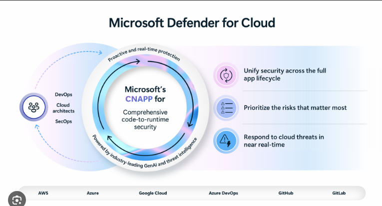

# Glossary and References (Volvo) – Day 3 Reverse KT

## Acronyms
- AFSB: AWS Foundational Security Best Practices
- CIS: Center for Internet Security
- CSPM: Cloud Security Posture Management
- DDoS: Distributed Denial of Service
- IAM: Identity and Access Management
- MCSB: Microsoft Cloud Security Benchmark
- MFA: Multi-Factor Authentication
- NIST: National Institute of Standards and Technology
- SOC: Security Operations Center
- SSO: Single Sign-On

## Tools/Services Mentioned
- Prisma Cloud: CSPM tool (vendor baseline configuration referenced)
- AWS Security Hub: CSPM/service findings aggregation and standards scoring
- AWS Control Tower: Landing zone governance baseline enabling standards
- Microsoft Defender for Cloud: CSPM posture and security recommendations view
- Microsoft Sentinel: Central SIEM/SOAR platform monitored by SOC
- Qualys: Vulnerability management tooling operated by Cyber Defense Center
- F5 Load Balancer: Application publishing / reverse proxy at edge
- Rubrik Security Cloud: Backup/cyber resilience platform (owned by backup team)

## Reference Image

