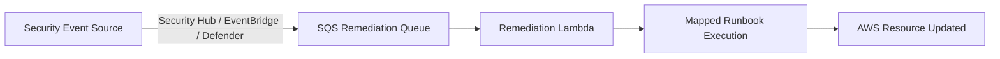

# AWS Automatic Remediations Inventory (Implemented Only)

> Scope: This inventory includes only implemented AWS automation and remediation controls evidenced in https://github.com/volvo-cars/mb-aws-infrastructure_as_code.

## Executive Summary

The Volvo AWS IaC implementation shows an active automated remediation stack built around:

1. Automated Security Response (ASR) with Security Hub playbooks and Systems Manager automation.
2. Event-driven custom remediation for S3 lifecycle enforcement (EventBridge -> SQS -> Lambda runbook).
3. Shared remediation Lambda runbooks used by both Prisma Cloud and Defender for Cloud integrations.
4. Implemented preventive guardrails through SCPs and AWS Organizations tag policies.

## Implemented Remediation Controls

| Control | Type | Trigger | Automated Action | Status | Evidence |
|---|---|---|---|---|---|
| Automated Security Response (ASR) | Security Hub remediation framework | Security Hub findings (single-click or auto-trigger rules) | Executes predefined remediation playbooks via AWS Systems Manager | Implemented | https://github.com/volvo-cars/mb-aws-infrastructure_as_code/tree/develop/bootstrap/shared-services/automated-remediation-framework/README.md |
| ASR Stack deployment | Platform automation | Terraform apply in shared services security account | Deploys SHARR templates and member stacksets for organization-wide remediation capability | Implemented | https://github.com/volvo-cars/mb-aws-infrastructure_as_code/tree/develop/bootstrap/shared-services/automated-remediation-framework/ar_audit_stack.tf |
| S3 lifecycle policy auto-remediation | Event-driven custom remediation | CloudTrail CreateBucket event via EventBridge | Sends event to remediation SQS; triggers aws_sss_1001 runbook to apply default lifecycle policy when missing | Implemented | https://github.com/volvo-cars/mb-aws-infrastructure_as_code/tree/develop/bootstrap/accounts/prod/awsmain/eu-west-1/eventbridge.tf |
| Prisma enhanced remediation orchestration | CNAPP remediation platform | Queue messages and mapped policy/runbook sources | Routes findings to remediation Lambda runbooks with source-to-runbook mapping | Implemented | https://github.com/volvo-cars/mb-aws-infrastructure_as_code/tree/develop/services/shared-services/prismacloud-enhanched-remediation/README.md |
| S3 SSL enforcement runbook | Lambda runbook remediation | Finding mapped to aws_sss_002 | Updates bucket policy to deny unencrypted transport (SecureTransport=false) | Implemented | https://github.com/volvo-cars/mb-aws-infrastructure_as_code/tree/develop/services/shared-services/prismacloud-enhanched-remediation/lambda/runbooks/aws_sss_002.py |
| S3 logging enablement runbook | Lambda runbook remediation | Finding mapped to aws_sss_009 | Enables S3 bucket logging and creates/uses target logging bucket | Implemented | https://github.com/volvo-cars/mb-aws-infrastructure_as_code/tree/develop/services/shared-services/prismacloud-enhanched-remediation/lambda/runbooks/aws_sss_009.py |
| S3 lifecycle enforcement runbook | Lambda runbook remediation | EventBridge lifecycle enforcement mapping to aws_sss_1001 | Applies lifecycle rules and tags for remediation handling | Implemented | https://github.com/volvo-cars/mb-aws-infrastructure_as_code/tree/develop/services/shared-services/prismacloud-enhanched-remediation/lambda/runbooks/aws_sss_1001.py |
| Defender for Cloud to AWS remediation bridge | Cross-platform remediation integration | Defender workflow builds remediation message and sends to SQS | AWS remediation Lambda consumes message and executes mapped runbook | Implemented | https://github.com/volvo-cars/mb-aws-infrastructure_as_code/tree/develop/services/shared-services/defender-for-cloud-remediation/README.md |

## Implemented Preventive Guardrails (Automation)

| Control | Type | Automated Enforcement | Status | Evidence |
|---|---|---|---|---|
| Root-level SCP framework | Organizations governance automation | Terraform-managed root policies and OU attachments enforcing deny controls | Implemented | https://github.com/volvo-cars/mb-aws-infrastructure_as_code/tree/develop/bootstrap/shared-services/security/scps.tf |
| ProtectPlatformResources SCP | Preventive guardrail | Denies unauthorized CloudFormation/Lambda modification on Terraform-managed resources | Implemented | https://github.com/volvo-cars/mb-aws-infrastructure_as_code/tree/develop/bootstrap/shared-services/security/scps.tf |
| Region and network restriction SCP patterns | Preventive guardrail | Deny patterns for restricted regions and on-prem/network connectivity actions | Implemented | https://github.com/volvo-cars/mb-aws-infrastructure_as_code/tree/develop/bootstrap/shared-services/security/scps.tf |
| Organization tag policies | Preventive governance automation | Enforces required tag keys across AWS resource scopes at root OU | Implemented | https://github.com/volvo-cars/mb-aws-infrastructure_as_code/tree/develop/bootstrap/shared-services/security/tag_policies.tf |
| Required default IaC tagging pattern | Baseline control automation | Standard default tags include owner-appid, envtype, layer, managed_by, git_org, git_repo | Implemented | https://github.com/volvo-cars/mb-aws-infrastructure_as_code/tree/develop/services/shared-services/prismacloud-enhanched-remediation/locals.tf |

## Remediation Integration Flow (Implemented)

## Source Evidence Index

- ASR framework and playbook model:
  - https://github.com/volvo-cars/mb-aws-infrastructure_as_code/tree/develop/bootstrap/shared-services/automated-remediation-framework/README.md
  - https://github.com/volvo-cars/mb-aws-infrastructure_as_code/tree/develop/bootstrap/shared-services/automated-remediation-framework/ar_audit_stack.tf
  - https://github.com/volvo-cars/mb-aws-infrastructure_as_code/tree/develop/bootstrap/shared-services/automated-remediation-framework/ar_member_account_stackset.tf
  - https://github.com/volvo-cars/mb-aws-infrastructure_as_code/tree/develop/bootstrap/shared-services/automated-remediation-framework/ar_member_role_stackset.tf
- EventBridge lifecycle remediation pattern:
  - https://github.com/volvo-cars/mb-aws-infrastructure_as_code/tree/develop/bootstrap/accounts/prod/awsmain/eu-west-1/eventbridge.tf
- Prisma enhanced remediation and runbooks:
  - https://github.com/volvo-cars/mb-aws-infrastructure_as_code/tree/develop/services/shared-services/prismacloud-enhanched-remediation/README.md
  - https://github.com/volvo-cars/mb-aws-infrastructure_as_code/tree/develop/services/shared-services/prismacloud-enhanched-remediation/runbooks.tf
  - https://github.com/volvo-cars/mb-aws-infrastructure_as_code/tree/develop/services/shared-services/prismacloud-enhanched-remediation/lambda/runbooks/aws_sss_002.py
  - https://github.com/volvo-cars/mb-aws-infrastructure_as_code/tree/develop/services/shared-services/prismacloud-enhanched-remediation/lambda/runbooks/aws_sss_009.py
  - https://github.com/volvo-cars/mb-aws-infrastructure_as_code/tree/develop/services/shared-services/prismacloud-enhanched-remediation/lambda/runbooks/aws_sss_1001.py
- Defender for Cloud integration to shared remediation Lambda:
  - https://github.com/volvo-cars/mb-aws-infrastructure_as_code/tree/develop/services/shared-services/defender-for-cloud-remediation/README.md
- SCP and tag policy governance automation:
  - https://github.com/volvo-cars/mb-aws-infrastructure_as_code/tree/develop/bootstrap/shared-services/security/scps.tf
  - https://github.com/volvo-cars/mb-aws-infrastructure_as_code/tree/develop/bootstrap/shared-services/security/README.md
  - https://github.com/volvo-cars/mb-aws-infrastructure_as_code/tree/develop/bootstrap/shared-services/security/tag_policies.tf
