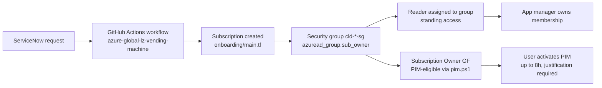
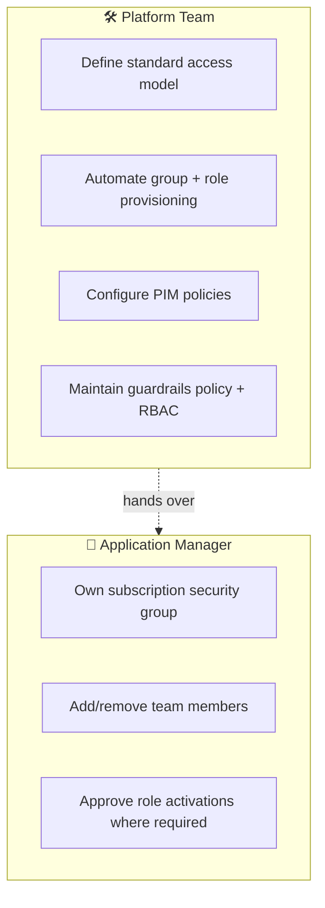

# 🛡️ Azure RBAC Framework

> Purpose: Client-facing reverse KT material summarizing our understanding of the Azure access model built on role-based access control, group ownership, time-bound privileged elevation

## ✨ Core Principles

| # | Principle | What it means in practice |
|---|---|---|
| 1 | **Group-based access** | Permissions are bound to Entra ID security groups, never to individual users. |
| 2 | **Reader is the baseline** | Standing access is read-only; write/admin is always elevated. |
| 3 | **Elevation is time-bound** | Higher privileges flow through Azure PIM with bounded windows and justification. |
| 4 | **Lowest scope wins** | Prefer Resource Group / Subscription scope over Management Group scope. |
| 5 | **Change through code** | Terraform + Pull Request review is the default change path; portal use is the exception. |

---

## 🔄 End-to-End Access Lifecycle

---

## 🧭 Standard Subscription Access Model

In the greenfield setup, every new subscription follows a standardized RBAC pattern provisioned by [azure-global-lz-vending-machine](https://github.com/volvo-cars/azure-global-lz-vending-machine).

### What gets created during provisioning

| Step | Action | Implementation reference |
|---|---|---|
| 1 | Create dedicated security group `cld--sg` | [`src/asvm20/deployment/deployment.tf` → `azuread_group.sub_owner`](https://github.com/volvo-cars/azure-global-lz-vending-machine/blob/main/src/asvm20/deployment/deployment.tf) |
| 2 | Assign **Reader** to the group at subscription scope | [`src/asvm20/deployment/deployment.tf` → `azurerm_role_assignment.sub_owner`](https://github.com/volvo-cars/azure-global-lz-vending-machine/blob/main/src/asvm20/deployment/deployment.tf) |
| 3 | Configure PIM policy on the elevated role (auto-approve, 8h max, MFA + justification) | [`src/asvm20/deployment/pim.ps1` → `azurerm_role_management_policy.auto-approve`](https://github.com/volvo-cars/azure-global-lz-vending-machine/blob/main/src/asvm20/deployment/pim.ps1) |
| 4 | Make the group **eligible** for **Subscription Owner GF** via PIM | `azurerm_pim_eligible_role_assignment.subscription_owner` |
| 5 | Application manager set as group owner → manages membership going forward | `azuread_group.sub_owner` `owners = [data.azuread_user.user.object_id]` |

### Default access pattern for application teams

The model is intentionally split into two layers:

| Layer | Role | Nature | Activation |
|---|---|---|---|
| Standing | **Reader** | Permanent visibility into the subscription | None — granted at provisioning |
| Elevated | **Subscription Owner GF** | Administrative changes | Activated via PIM, bounded duration |

> Users live as Readers by default and elevate only when they need to perform administrative work.

---

## ⏱️ Elevation Model (PIM)

The elevated access model is designed for **temporary, justified** use, implemented through Azure Privileged Identity Management.

### Application subscription access

- Eligibility is configured per subscription by the vending machine (see `pim.ps1`)
- Activation requires **MFA + justification**
- **Maximum activation window: 8 hours** (`maximum_duration = "PT8H"` in `azurerm_role_management_policy.auto-approve`)
- Users can request a shorter window (e.g. 30 minutes) based on the task
- On expiry, access automatically reverts to Reader
- Active assignments expire after **180 days** (`expire_after = "P180D"`) — requiring re-justification

### Platform team access

Platform engineers operate under stricter controls, defined in [`azure-core-infrastructure/gov/L1/enterprise-scale/PIM-platform/`](https://github.com/volvo-cars/azure-core-infrastructure/tree/main/gov/L1/enterprise-scale/PIM-platform):

| Role | Standing? | Eligible? | Typical duration | Notes |
|---|---|---|---|---|
| **Reader** | ✅ Yes | — | — | Default standing access |
| **Contributor** | ❌ | ✅ | Longer (operational work) | Peer-reviewed activation |
| **Owner** | ❌ | ✅ | Shorter (high-risk work) | Peer-reviewed activation |

> 📌 Higher scopes (Management Group, Tenant Root) are avoided when a subscription or resource-group scope is sufficient.

---

## 👥 Ownership and Responsibilities

### Platform responsibilities

- Define the standard access model (this document)
- Automate group and role provisioning via the [vending machine](https://github.com/volvo-cars/azure-global-lz-vending-machine)
- Configure PIM eligibility and approval rules
- Maintain governance guardrails via [Azure Policy assignments](https://github.com/volvo-cars/azure-global-enterprise-scale/tree/main/code/L1)

### Application manager responsibilities

After provisioning, the application manager (set as `azuread_group.sub_owner.owners`) owns:

- Membership of the subscription security group
- Day-to-day access changes for the team
- Ensuring the right people remain in the right access group

This standardizes the platform model while delegating operational membership management to the application side.

---

## 🛠️ Preferred Operating Model

| Approach | When to use |
|---|---|
| **Terraform + Pull Request** | ✅ All infrastructure and RBAC changes |
| **Pipeline-driven workflow** | ✅ Subscription onboarding, policy updates, role assignments |
| **Azure Portal (with PIM elevation)** | ⚠️ Only when an action is not yet codified, or for break-glass scenarios |

### When a portal action is unavoidable

1. Raise a PIM activation request with a clear justification
2. Use peer review where the role requires it
3. Minimize scope before activation
4. Document the action so it can be folded back into code

The long-term direction is to reduce portal activity and shift review effort to code changes instead.

---

## 🤖 Automation Identities

Subscription provisioning and platform operations rely on dedicated, non-human identities (Entra Service Principals) declared in [`azure-core-infrastructure/DR/Layer0/config/spns.yaml` → `identities.tf`](https://github.com/volvo-cars/azure-core-infrastructure/tree/main/DR/Layer0).

| Service Principal | Purpose |
|---|---|
| `spn-az-onboarding-greenfield-prod` | Subscription vending — production |
| `spn-az-onboarding-greenfield-nonprod` | Subscription vending — non-production |
| `spn-az-onboarding-prod` | Platform onboarding |
| `spn-az-network-onboarding-prod` | Network Contributor for onboarding |
| `spn-az-iac-root-reader` | IaC read-only root reader |
| `spn-az-resourcelock-prod` | Resource lock management |
| `spn-azure-platform-management` | Platform management reader |

Key characteristics:

- ✅ Earlier, role assignments were handled only through Service Principals, which was not fully effective or secure for day-to-day owner operations
- ✅ Role assignments are now done directly in Azure Portal using personal IDs
- ✅ Subscription owners receive a modified **Subscription Owner (GF)** role to perform role assignments directly
- ✅ No more reliance on SPNs for everyday human role assignment tasks
- ✅ Custom role creation and custom role assignments are not allowed
- ✅ Over-privileged role assignments are blocked

This is a first step toward reducing SPN usage and strengthening platform security, while making role assignment flows simpler for subscription owners.

---

## ✅ Summary

| Pillar | What it delivers |
|---|---|
| 🏗️ **Standardized onboarding** | Every subscription gets the same RBAC shape via the vending machine |
| 👥 **Group-based RBAC** | Permissions follow Entra groups, not users |
| 📖 **Reader as standing access** | Default visibility without risk |
| ⏱️ **Time-bound elevation (PIM)** | Higher privilege only when needed, only for as long as needed |
| 🔄 **Delegated membership** | App managers own who is in their group; platform owns the model |
| 🧑‍💻 **GitOps-first operations** | Change through code review, not portal |
| 🤖 **Dedicated automation identities** | Auditable, segregated, secret-managed |
| 🔐 **Hardened break-glass** | Strong-auth protection for last-resort access |

The result is a model that supports **self-service where appropriate**, while maintaining **governance, auditability, and tightly controlled privilege elevation** — all implemented as code.

---