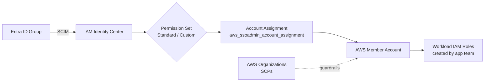
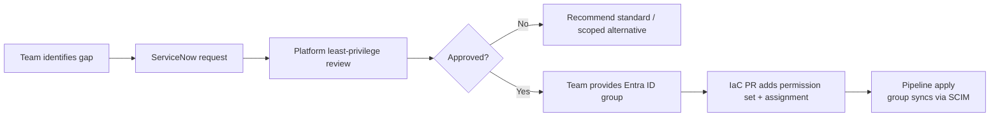

# AWS Custom Roles & Assignment Scopes

> **Purpose** — Explain how non-standard AWS access is **requested, implemented, and constrained**, and how assignment scope keeps permissions bounded.
>
> **Source of truth** — All identities, permission sets, group bindings, and account assignments described below are defined as code in [`volvo-cars/mb-aws-infrastructure_as_code`](https://github.com/volvo-cars/mb-aws-infrastructure_as_code). Console edits to managed resources are prohibited.
>
> **Key entry points**
> - SSO automation overview — [`bootstrap/docs/sso_automation.md`](https://github.com/volvo-cars/mb-aws-infrastructure_as_code/blob/develop/bootstrap/docs/sso_automation.md)
> - Shared-services SSO layer — [`bootstrap/shared-services/sso/README.md`](https://github.com/volvo-cars/mb-aws-infrastructure_as_code/blob/develop/bootstrap/shared-services/sso/README.md)
> - Standard + platform permission sets — [`bootstrap/shared-services/sso/sso.tf`](https://github.com/volvo-cars/mb-aws-infrastructure_as_code/blob/develop/bootstrap/shared-services/sso/sso.tf)
> - Custom permission sets — [`bootstrap/shared-services/sso/customization.tf`](https://github.com/volvo-cars/mb-aws-infrastructure_as_code/blob/develop/bootstrap/shared-services/sso/customization.tf)
> - Per-account assignment examples — `bootstrap/accounts/<env>/<account>/eu-west-1/sso/sso.tf`

---

## 1. Design Principles

| # | Principle | What it means in practice |
|---|---|---|
| 1 | **Standard-first, exception-second** | Teams start with standard sets; custom access requires a justified request. |
| 2 | **Group-based assignment** | Permission sets bind to **Entra ID groups**, never to individual users. |
| 3 | **IaC over console** | Every permission set, group, and account assignment is in Terraform. |
| 4 | **Scoped by design** | Assignments target a **single AWS account**; SCPs cap effective privilege. |
| 5 | **Least privilege** | Custom sets prefer narrow inline / customer-managed policies over broad AWS managed ones. |

---

## 2. The Three Layers of "Custom Access" in AWS



| Layer | AWS construct | Used for | Code reference |
|---|---|---|---|
| Human access | **Custom permission set** | Federated SSO access to specific accounts | [`customization.tf`](https://github.com/volvo-cars/mb-aws-infrastructure_as_code/blob/develop/bootstrap/shared-services/sso/customization.tf) |
| Workload access | **IAM role** in the account | EC2 / ECS / Lambda / cross-account | App team owns inside their account |
| Last-resort programmatic | **IAM user + permission boundary** | Tools that support no role/OIDC | Created via Terraform only |

> Preferred order: **Standard permission set → Custom permission set → IAM role → IAM user (exception)**.

---

## 3. Standard Baseline Before Customization

Every onboarded account receives a baseline pair of permission sets, bound to two AVM-created Entra ID groups (one admin, one reader).

```hcl
# bootstrap/shared-services/sso/sso.tf
resource "aws_ssoadmin_permission_set" "app_admin" {
  name             = "AWSAdministratorAccess"
  description      = "Provides full access to AWS services and resources"
  instance_arn     = tolist(data.aws_ssoadmin_instances.sso_id.arns)[0]
  session_duration = "PT8H"
}

resource "aws_ssoadmin_permission_set" "read_only" {
  name             = "AWSReadOnlyAccess"
  description      = "This policy grants permissions to view resources and basic metadata across all AWS services"
  instance_arn     = tolist(data.aws_ssoadmin_instances.sso_id.arns)[0]
  session_duration = "PT8H"
}
```

> **Note** — `AWSAdministratorAccess` (workload teams) and `AdministratorAccess` (platform / PCE) look similar on paper but are differentiated by **SCP boundaries** on the accounts they are assigned in. See [`sso.tf` L375-L409](https://github.com/volvo-cars/mb-aws-infrastructure_as_code/blob/develop/bootstrap/shared-services/sso/sso.tf#L375-L409).

---

## 4. What Counts as a "Custom Permission Set"

A custom set is anything beyond the standard catalog — typically built with:

- one or more **AWS managed policy attachments** (`aws_ssoadmin_managed_policy_attachment`)
- a **scoped inline policy** (`aws_ssoadmin_permission_set_inline_policy`)
- optional **customer-managed policy reference** (`aws_ssoadmin_customer_managed_policy_attachment`)

### Example A — Narrow, account-specific custom set

```hcl
# bootstrap/shared-services/sso/customization.tf
resource "aws_ssoadmin_permission_set" "vemc_custom_policy" {
  name             = "VemcCustomPolicy"
  description      = "Limited Write Permission to EC2 service for 241301692749 Account."
  instance_arn     = tolist(data.aws_ssoadmin_instances.sso_id.arns)[0]
  session_duration = "PT8H"
}

resource "aws_ssoadmin_permission_set_inline_policy" "vemc_custom_policy" {
  inline_policy      = data.aws_iam_policy_document.vemc_custom_policy.json
  instance_arn       = aws_ssoadmin_permission_set.vemc_custom_policy.instance_arn
  permission_set_arn = aws_ssoadmin_permission_set.vemc_custom_policy.arn
}
```

### Example B — FinOps split by duty (Billing vs. Savings Plans)

```hcl
resource "aws_ssoadmin_permission_set" "finops" {
  name        = "FinOpsBillingSupportS3"
  description = "FinOps Billing, Support, S3 buckets permission set for management Account."
  # + AWSSupportAccess, Billing managed policies + scoped inline S3 policy
}

resource "aws_ssoadmin_permission_set" "finops_savings" {
  name        = "FinOpsSavingsPlans"
  description = "FinOps Savings Plans permission set for management Account."
  # + AWSSavingsPlansFullAccess
}
```

Source: [`sso.tf` L572-L699](https://github.com/volvo-cars/mb-aws-infrastructure_as_code/blob/develop/bootstrap/shared-services/sso/sso.tf#L572-L699)

### Example C — Customer-managed policy attachment (decoupled lifecycle)

```hcl
resource "aws_ssoadmin_customer_managed_policy_attachment" "data_identity_read_only_1" {
  instance_arn       = aws_ssoadmin_permission_set.data_identity_read_only.instance_arn
  permission_set_arn = aws_ssoadmin_permission_set.data_identity_read_only.arn
  customer_managed_policy_reference {
    name = "mwaa_readonly"
    path = "/"
  }
}
```

---

## 5. Request & Approval Flow



Hard rules:

- The requesting team **must supply an Entra ID group** — platform does not create groups for custom requests.
- All custom sets and assignments live under `bootstrap/shared-services/sso/` and the per-account `sso/` folders, so they are **diffable, reviewable, and reversible**.
- SCIM sync from Entra ID to IAM Identity Center can take up to ~1 hour (documented in every generated [account `sso/README.md`](https://github.com/volvo-cars/mb-aws-infrastructure_as_code/blob/develop/bootstrap/templates/sso/README.md.tftpl.j2)).

---

## 6. Assignment Scope — How a Permission Set Becomes Access

Scope is enforced by **three concentric layers**.

### 6.1 Account-level assignment (the binding)

Every grant is **one explicit Terraform resource per (group × permission set × account)**:

```hcl
# bootstrap/accounts/prod/<account>/eu-west-1/sso/sso.tf
resource "aws_ssoadmin_account_assignment" "cld_aws_<account>_admin_sg_awsadministratoraccess" {
  provider           = aws.orgmaster
  instance_arn       = tolist(data.aws_ssoadmin_instances.sso_id.arns)[0]
  permission_set_arn = "arn:aws:sso:::permissionSet/ssoins-68049faf85632c54/ps-98ec57508804726f" # AWSAdministratorAccess

  principal_id   = "<entra-group-object-id>"
  principal_type = "GROUP"

  target_id   = "<aws-account-id>"
  target_type = "AWS_ACCOUNT"

  lifecycle {
    # Product Owner changes update principal_id manually; ignore drift
    ignore_changes = [principal_id]
  }
}
```

Real example: [`app-4676-online-prod-001/.../sso/sso.tf` L33-L53](https://github.com/volvo-cars/mb-aws-infrastructure_as_code/blob/develop/bootstrap/accounts/prod/app-4676-online-prod-001/eu-west-1/sso/sso.tf#L33-L53).

> **Effect** — Access is **per-account, per-group, per-permission-set**. There is no global grant.

### 6.2 Organization-level guardrails (SCPs)

Even a broad permission set is still bounded by Service Control Policies at the AWS Organization, which block actions like disabling Config / GuardDuty, modifying org trails, or touching delegated admin resources.

### 6.3 Workload-managed roles inside the account

Teams with `AWSAdministratorAccess` can create their own IAM roles for EC2, Lambda, cross-account, and integrations — but those roles still operate **under the same workload SCPs**.

---

## 7. IAM Users — The Exception Path

IAM users are **only** created when no role-based or federated mechanism is viable.

Controls enforced via IaC:

- Created through Terraform — never the console
- **Programmatic access only** (no console password)
- A **permission boundary** is attached to prevent self-escalation
- Access keys scoped to a single documented use case
- Exposure detection (e.g., GitHub secret scanning) triggers an **IaC-driven rotation** (destroy + recreate)

---
