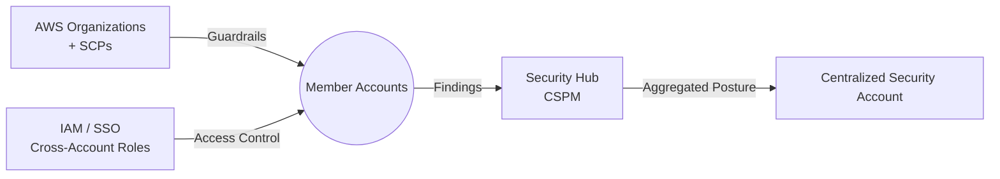

# AWS Native Security Controls

> Purpose: Client-facing reverse KT material summarizing our understanding of the three foundational AWS-native security pillars in use:
> **AWS Organizations / SCPs**, **Cloud Security Posture Management (Security Hub)**, and **AWS IAM**.

---

## Executive Snapshot

The AWS security baseline is anchored by three native services that, together, deliver **prevent**, **detect**, and **govern** capabilities across the organization:

| # | Pillar | Service | Primary Role |
|---|---|---|---|
| 1 | Preventive Guardrails | **AWS Organizations + SCPs** | Block high-risk actions before they occur |
| 2 | Posture Management (CSPM) | **AWS Security Hub** | Continuous compliance and finding aggregation |
| 3 | Identity & Access | **AWS IAM (+ SSO, SLRs, Cross-Account Roles)** | Enforce least-privilege and delegated administration |

---

## Architecture at a Glance

| Layer | Service | What it Delivers |
|---|---|---|
| **Prevent** | Organizations / SCPs | OU-level deny boundaries, root restrictions, IMDSv2, billing & security action protection |
| **Detect** | Security Hub | Multi-region finding aggregation, CIS standards, central configuration policy |
| **Govern** | IAM | Service-linked roles

---

## 1. AWS Organizations + Service Control Policies (SCPs)

**Role:** The *preventive* governance layer applied across all Organizational Units (OUs).

### Standards Enabled

| Standard | Version |
|---|---|
| AWS Foundational Security Best Practices (FSBP) | 1.0.0 |
| CIS AWS Foundations Benchmark | 1.2.0 |
| CIS AWS Foundations Benchmark | 1.4.0 |

### Why this Matters
- **Centralizes** findings and governance across all accounts and regions.
- Enables **standards-based** compliance monitoring (AWS FSBP, CIS).
- Provides a single pane of glass for posture, drift, and control attestation.

---

## 2. AWS IAM — Identity, Access & Delegation

**Role:** Foundation for **least-privilege** and **separation of duties**

### Why this Matters

- Supports **auditable access patterns** and **least-privilege** operations.

---

## Summary

| Pillar | Outcome |
|---|---|
| **Organizations + SCPs** | Prevent misconfiguration at the perimeter of every account |
| **Security Hub (CSPM)** | Detect drift and non-compliance against AWS FSBP & CIS |
| **IAM** | Govern who and what can act, with least privilege by design |

Together these three services form the **prevent–detect–govern** core of the AWS-native security posture.

