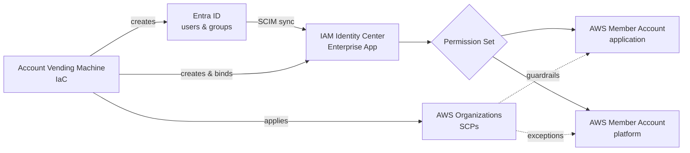
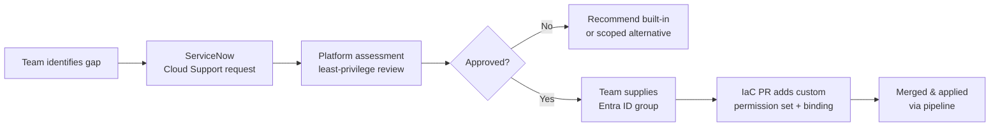

# AWS RBAC Framework Custom Permission sets

> Purpose: Client-facing reverse KT material summarizing our understanding AWS accounts built on centralized identity (Entra ID + IAM Identity Center), standardized & custom permission sets, and organization-wide guardrails.

> **Source of truth**
> All identities, permission sets, SCPs, and break-glass constructs described here are defined as code in [`volvo-cars/mb-aws-infrastructure_as_code`](https://github.com/volvo-cars/mb-aws-infrastructure_as_code). Console edits to managed resources are prohibited.
>
> **Key entry points**
> - SSO automation overview — [`bootstrap/docs/sso_automation.md`](https://github.com/volvo-cars/mb-aws-infrastructure_as_code/blob/develop/bootstrap/docs/sso_automation.md)
> - SSO shared services (permission sets, enterprise app, customization) — [`bootstrap/shared-services/sso/README.md`](https://github.com/volvo-cars/mb-aws-infrastructure_as_code/blob/develop/bootstrap/shared-services/sso/README.md)
> - Custom permission-set definitions — [`bootstrap/shared-services/sso/customization.tf`](https://github.com/volvo-cars/mb-aws-infrastructure_as_code/blob/develop/bootstrap/shared-services/sso/customization.tf)

---

## 1. Core Principles

| # | Principle | What it means in practice |
|---|---|---|
| 1 | **SSO-first for humans** | All human access to AWS is federated from Entra ID through IAM Identity Center. Local IAM users are not the normal access path. |
| 2 | **Group-based assignment** | Permission sets are bound to Entra ID groups, never to individual users. |
| 3 | **Least privilege by default** | Workload roles are scoped to the account; org-level actions are reserved for the platform team via SCP exceptions. |
| 4 | **Guardrails enforced centrally** | SCPs and permission boundaries restrict what any principal can do, regardless of attached policies. |
| 5 | **IaC over console** | All managed resources are provisioned and changed via Terraform; drift is detected by workflows. |
| 6 | **Exceptions are assessed, not assumed** | Custom permission sets and IAM users require a justified ServiceNow request and platform review. |

---

## 2. Identity Architecture at a Glance



- **Entra ID** is the identity provider; groups are the unit of assignment.
- **IAM Identity Center** holds the permission sets and federates access to member accounts.
- **AWS Organizations + SCPs** form the outer boundary; permission sets define the inner ceiling.
- **Account Vending Machine (AVM)** automates the wiring during onboarding.

> **Source of truth**
> - End-to-end SSO automation — [`bootstrap/docs/sso_automation.md`](https://github.com/volvo-cars/mb-aws-infrastructure_as_code/blob/develop/bootstrap/docs/sso_automation.md)
> - SSO shared-services layer overview — [`bootstrap/shared-services/sso/README.md`](https://github.com/volvo-cars/mb-aws-infrastructure_as_code/blob/develop/bootstrap/shared-services/sso/README.md)

---

## 3. Permission Sets

### 3.1 Standard permission sets

Every onboarded account receives the baseline pair, assigned to two dedicated Entra ID groups:

| Permission set | Intended consumers | Notes |
|---|---|---|
| `AWSAdministratorAccess` | Workload / application teams | Broad in-account admin; constrained by workload SCPs. |
| `AWSReadOnlyAccess` | Workload / application teams | Visibility without write privileges. |

### 3.2 Platform vs workload administration

Two administrator-style permission sets are intentionally separated:

| Permission set | Who uses it | Why it is separate |
|---|---|---|
| `AdministratorAccess` | Public Cloud Enablement (platform) | Carries SCP **exceptions** required to operate org-level services (e.g. AWS Config, GuardDuty, Organizations). |
| `AWSAdministratorAccess` | Application teams | Functionally similar IAM policy, but **bound by full workload SCPs** — blocked from disabling org-level services or touching platform-managed resources. |

> The policy documents on the two sets look nearly identical. **The real difference is the SCP boundary** applied to the accounts each set is assigned in. This split lets the platform team operate the organization without granting workload teams the same blast radius.

The platform team is included in the SCP exception list for ~95% of policies. Notable carve-outs (e.g. **AWS Marketplace** purchases) remain restricted because they belong to other organizational owners (finance). Selected platform teams (e.g. networking) receive additional, scoped exceptions where operationally required.

### 3.3 Auditor & shared-services permission sets

| Permission set | Purpose |
|---|---|
| `PublicCloudEnablement-Admin` | Day-to-day platform operations. |
| `PublicCloudEnablement-Auditor` | Read-only visibility across the organization for the platform team. |

### 3.4 FinOps permission sets

FinOps is intentionally split into two custom sets so not every FinOps member can purchase commitments:

| Permission set | Capability |
|---|---|
| `FinOps-BillingAccess` | View billing, cost & usage, budgets. |
| `FinOps-SavingsPlansFullAccess` | Manage Savings Plans / Reserved Instances (restricted subset of FinOps). |

> **Source of truth**
> - Standard, platform, auditor, and FinOps permission sets are defined alongside the customization layer described in [`bootstrap/shared-services/sso/README.md`](https://github.com/volvo-cars/mb-aws-infrastructure_as_code/blob/develop/bootstrap/shared-services/sso/README.md).

---

## 4. Entra ID Groups

### 4.1 Naming convention

Every account receives two groups created by the AVM, following a deterministic pattern:

```
<appId>-<networkArchetype>-<accountSuffix>-<admin|reader>-<paddedAccountNumber>
```

Example:

```
app1234-connected-prod-admin-0007
app1234-connected-prod-reader-0007
```

This pattern keeps the group purpose, target account, and environment unambiguous at a glance.

### 4.2 Group lifecycle

| Stage | Owner | Action |
|---|---|---|
| Creation | AVM (automation) | Group created in Entra ID, application owner set as group owner + first member. |
| Sync | AVM (automation) | Group assigned to the IAM Identity Center enterprise application; synced into AWS. |
| Binding | AVM (automation) | Group bound to the correct AWS account + permission set. |
| Day-2 membership | **Application owner** | Adds/removes members as the team evolves (joiners / movers / leavers). |
| Decommission | AVM (automation) | Groups created by AVM are removed during account decommission. Groups created manually outside AVM are **not** managed. |

> Membership changes are deliberately **ignored by Terraform** (`lifecycle { ignore_changes = [members] }`) so day-to-day joiner/leaver actions by the application owner do not produce drift.

> **Source of truth**
> - Group naming pattern, owner delegation, enterprise-app assignment, and SCIM sync are documented in [`bootstrap/docs/sso_automation.md`](https://github.com/volvo-cars/mb-aws-infrastructure_as_code/blob/develop/bootstrap/docs/sso_automation.md).

---

## 5. Custom Permission Sets

Custom permission sets are reserved for genuine gaps that built-in or standard sets cannot fill (e.g. third-party tool onboarding, narrowly scoped internal roles, cross-team access).

### 5.1 Request flow



Key rules:

- The requesting team **must provide an Entra ID group** to bind the custom set to — the platform team does not create those groups for custom requests.
- The platform team performs a **least-privilege assessment** before any custom set is created. Requests for broad or root-equivalent access are challenged and re-scoped.
- All custom permission sets live under the SSO shared-services layer of the IaC repo so they are reviewable, diffable, and reversible.

> **Source of truth**
> - Custom permission-set catalog (Terraform) — [`bootstrap/shared-services/sso/customization.tf`](https://github.com/volvo-cars/mb-aws-infrastructure_as_code/blob/develop/bootstrap/shared-services/sso/customization.tf)
> - Shared-services layer & request flow context — [`bootstrap/shared-services/sso/README.md`](https://github.com/volvo-cars/mb-aws-infrastructure_as_code/blob/develop/bootstrap/shared-services/sso/README.md)

---

## 6. Guardrails

### 6.1 Service Control Policies (SCPs)

SCPs are the outer boundary. They:

- Block workload teams from disabling or modifying **organization-level services** (AWS Config, GuardDuty, CloudTrail org trail, Organizations APIs, etc.).
- Protect **platform-managed resources** (delegated admin accounts, central log archive, security tooling).
- Restrict **regions, services, and resource types** the organization has decided not to consume by default.
- Provide **scoped exceptions** for platform principals where operationally required (the exception is targeted at the principal/OU, not opened globally).

### 6.2 Permission boundaries (for IAM users)

When an IAM user is unavoidable (see §7), a **permission boundary** is attached so the user cannot escalate beyond the intended scope. Typical denials in the boundary:

- `iam:CreatePolicy*`, `iam:AttachUserPolicy`, `iam:PutUserPolicy` on self
- `iam:DetachUserPolicy`, `iam:DeleteUserPolicy` on self
- `iam:DeleteUser`, `iam:UpdateUser` on self
- Anything outside the approved service/resource scope for the use case

---

## 7. Human vs Machine Access

### 7.1 Human access

- **Always** via IAM Identity Center (SSO from Entra ID).
- Console and CLI access both flow through SSO; no human consumes long-lived AWS access keys.

### 7.2 Machine / application access — preferred order

1. **IAM roles assumed by AWS services** (EC2 instance profiles, ECS/EKS task roles, Lambda execution roles).
2. **Cross-account roles** assumed by trusted principals (preferred for any in-AWS service-to-service or account-to-account access).
3. **OIDC / federated identities** (e.g. GitHub Actions, third-party SaaS that supports OIDC).
4. **IAM users** — **exception only**, when the consuming tool genuinely supports no other auth mechanism.

### 7.3 IAM user controls

When an IAM user is approved, the following is enforced via IaC:

- Created exclusively through Terraform — never via the console.
- **Programmatic access only** (no console password).
- A **permission boundary** is attached.
- Access keys are scoped to a single documented use case.
- Exposure detection (e.g. GitHub secret-scanning alerts) triggers an **IaC-driven rotation**: the user is destroyed and recreated, generating fresh credentials.

### 7.4 Workload-created IAM roles

Application teams with `AWSAdministratorAccess` can create their own IAM roles inside their account (e.g. for EC2 → S3, cross-account access, third-party integrations). These roles remain bounded by the workload SCPs, so the team retains autonomy without opening org-level risk.

---