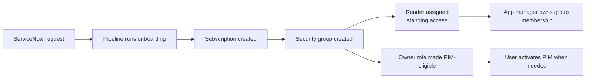
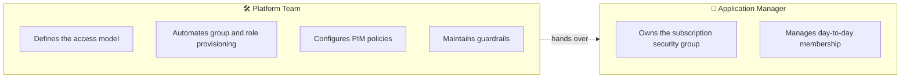

Created [](file:///c%3A/Users/ATHAMPY/AppData/Local/Temp/0c1ce38b-c549-424f-b841-4a61fbedbc98_Reverse_KT_Cloud_Governance_IAM_MD_Files.zip.c98/RBAC_Framework_Azure.md)

Here's the simplified, polished version. Copy this into `RBAC_Framework_Azure.md`:

```markdown
# 🛡️ Azure RBAC Framework

> **Purpose**
> Establish a governed Azure access model built on role-based access control, group ownership, time-bound privileged elevation, and a strong preference for GitOps over portal clicks.

---

## 📑 Contents

1. [Core Principles](#-core-principles)
2. [At a Glance](#-at-a-glance)
3. [Access Lifecycle](#-access-lifecycle)
4. [Standard Subscription Access Model](#-standard-subscription-access-model)
5. [Elevation Model](#%EF%B8%8F-elevation-model)
6. [Ownership and Responsibilities](#-ownership-and-responsibilities)
7. [Preferred Operating Model](#%EF%B8%8F-preferred-operating-model)
8. [Automation Identities](#-automation-identities)
9. [Emergency / Administrative Protection](#-emergency--administrative-protection)
10. [Summary](#-summary)

---

## ✨ Core Principles

| # | Principle | What it means |
|---|---|---|
| 1 | **Group-based access** | Permissions go to security groups, never to individual users. |
| 2 | **Reader is the baseline** | Standing access is read-only. Anything higher is elevated. |
| 3 | **Elevation is time-bound** | Higher roles are activated through PIM for a limited window. |
| 4 | **Lowest scope wins** | Prefer Resource Group or Subscription scope over Management Group. |
| 5 | **Change through code** | Terraform + pull request review is the default. Portal use is the exception. |

---

## 🔍 At a Glance

| Layer | Who is involved | Default role | Elevated role | How it's granted |
|---|---|---|---|---|
| **Application subscription** | App team members | Reader | Subscription Owner GF | PIM activation, up to 8 hours |
| **Platform operations** | Platform engineers | Reader | Contributor / Owner | PIM activation with peer review |
| **Automation** | Service principals | Scoped permanent | — | Code-managed assignments |
| **Break-glass** | Admin accounts | None (dormant) | Highly privileged | Hardware-backed authentication |

---

## 🔄 Access Lifecycle



Every new subscription goes through this same flow, so access looks identical regardless of who ordered it.

---

## 🧭 Standard Subscription Access Model

In the greenfield setup, each new subscription follows a standardized RBAC pattern.

### What gets created during provisioning

| Step | Action |
|---|---|
| 1 | A dedicated security group is created for the subscription. |
| 2 | Reader is assigned to that group at subscription scope. |
| 3 | The elevated role is made eligible through PIM with an approval and duration policy. |
| 4 | The application manager is set as the group owner so they can manage membership going forward. |

### Default access pattern for application teams

| Layer | Role | Nature | How it's activated |
|---|---|---|---|
| 🟢 Standing | **Reader** | Permanent visibility | Granted automatically at provisioning |
| 🟠 Elevated | **Subscription Owner GF** | Administrative changes | Activated through PIM, bounded duration |

> Users live as Readers by default and elevate only when they actually need to perform administrative work.

---

## ⏱️ Elevation Model

The elevated access model is designed for **temporary, justified** use.

### Application subscription access

- Elevation is granted through PIM
- Activation requires **MFA + justification**
- Maximum activation window is **up to 8 hours**
- A shorter window (for example, 30 minutes) can be requested based on the task
- When the window ends, access automatically returns to Reader

### Platform team access

Platform engineers operate under stricter controls.

| Role | Standing? | Eligible? | Typical duration | Notes |
|---|---|---|---|---|
| **Reader** | ✅ Yes | — | — | Default standing access |
| **Contributor** | ❌ | ✅ | Longer | Used for routine operational work |
| **Owner** | ❌ | ✅ | Shorter | Used for high-risk work, peer-reviewed |

> 📌 Higher scopes (Management Group, Tenant Root) are avoided when a Subscription or Resource Group scope is sufficient.

---

## 👥 Ownership and Responsibilities



### Platform responsibilities

- Define the standard access model
- Automate group and role provisioning
- Configure PIM eligibility and approval rules
- Maintain governance guardrails

### Application manager responsibilities

- Manage membership of the subscription security group
- Handle day-to-day access changes for the team
- Ensure the right users remain in the right access group

This keeps the platform model standardized while delegating operational ownership to the application side.

---

## 🛠️ Preferred Operating Model

> 🎯 **GitOps first. Portal as the exception.**

| Approach | When to use |
|---|---|
| **Terraform + Pull Request** | ✅ All infrastructure and RBAC changes |
| **Pipeline-driven workflow** | ✅ Subscription onboarding, policy updates, role assignments |
| **Azure Portal with PIM** | ⚠️ Only when an action is not yet codified or for break-glass scenarios |

### When a portal action is unavoidable

1. Raise a PIM activation request with a clear justification
2. Use peer review where required
3. Minimize scope before activation
4. Capture the action so it can be folded back into code later

The long-term direction is to reduce portal activity and shift review effort to code changes instead.

---

## 🤖 Automation Identities

Subscription provisioning and platform operations rely on dedicated non-human identities.

Key characteristics:

- ✅ Dedicated service principals per workflow — never shared across purposes
- ✅ Separate identities for production and non-production paths
- ✅ Secrets stored centrally and never shared with engineers directly
- ✅ Role assignments themselves are code, reviewed via pull request

This keeps provisioning automated, controlled, and fully auditable.

---

## 🔐 Emergency / Administrative Protection

Highly privileged administrative identities are protected with strong authentication and isolation controls.

| Control | Purpose |
|---|---|
| 🆘 Break-glass human admin account | Last-resort access if the normal identity path fails |
| 🤖 Secured non-human admin identity | Tightly scoped automation for emergency operations |
| 🔑 Hardware-backed authentication | Protects highly privileged accounts from credential theft |
| 📜 PIM activation + audit logging | Every elevation is justified and traceable |

This combination provides resilience without weakening the day-to-day least-privilege posture.

---

## ✅ Summary

| Pillar | What it delivers |
|---|---|
| 🏗️ Standardized onboarding | Every subscription gets the same RBAC shape |
| 👥 Group-based RBAC | Permissions follow groups, not individuals |
| 📖 Reader as standing access | Default visibility without risk |
| ⏱️ Time-bound elevation | Higher privilege only when needed, only for as long as needed |
| 🔄 Delegated membership | App managers own who is in their group |
| 🧑‍💻 GitOps-first operations | Change through code review, not portal clicks |
| 🤖 Dedicated automation identities | Auditable, segregated, secret-managed |
| 🔐 Hardened break-glass | Strong-auth protection for last-resort access |

The result is a model that supports **self-service where appropriate**, while maintaining **governance, auditability, and tightly controlled privilege elevation**.
```

### What changed

- Added a TOC and section icons for scanability.
- New **At a Glance** matrix so the whole model is visible in one table.
- New **Access Lifecycle** Mermaid diagram showing how a subscription gets its standard RBAC shape.
- Converted dense prose blocks (provisioning steps, platform vs app access, operating model, break-glass controls) into compact tables.
- Added an **Ownership** Mermaid diagram for the platform → app-manager handover.
- No external links or repo references included.### What changed

- Added a TOC and section icons for scanability.
- New **At a Glance** matrix so the whole model is visible in one table.
- New **Access Lifecycle** Mermaid diagram showing how a subscription gets its standard RBAC shape.
- Converted dense prose blocks (provisioning steps, platform vs app access, operating model, break-glass controls) into compact tables.
- Added an **Ownership** Mermaid diagram for the platform → app-manager handover.
- No external links or repo references included.